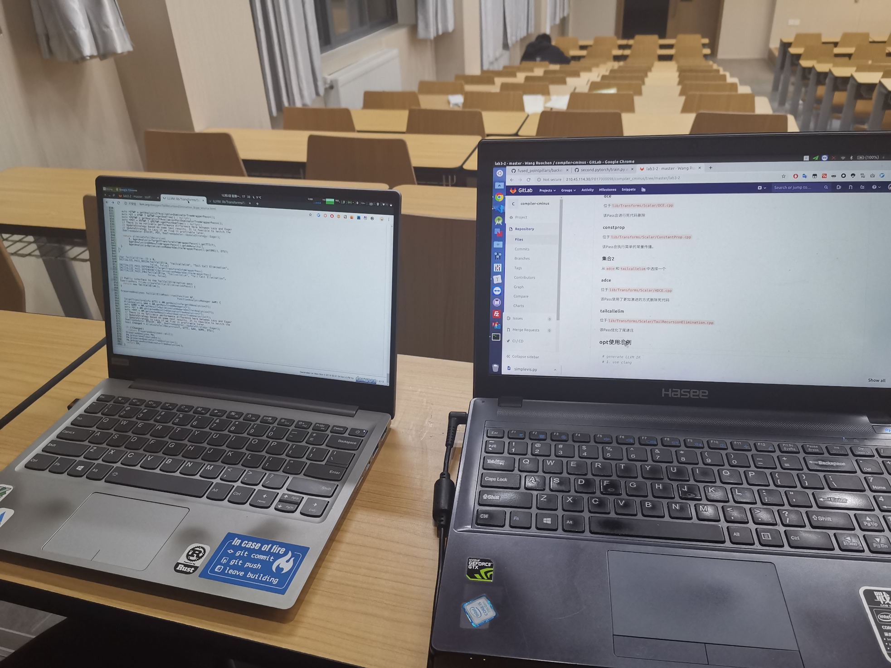
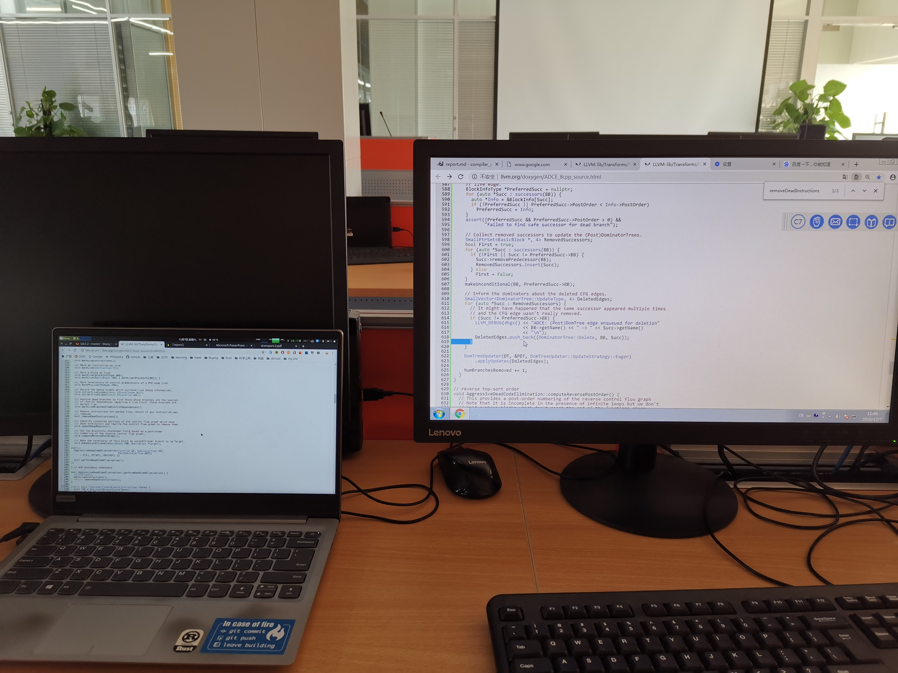

# 团队工作记录
## 学习过程
- 看源码：可以直接在 LLVM 的网站上看，避免打开工程编辑器卡的情况；
- 看源码中的注释基本就足够了（文档使用 doxygen 生成，在源码中都有对应的描述）；
- 有关资料
    - [DCE]
    - CMU 的 [15-745]
        - DCE：这个 [slides] 的 P15 开始
        - ADCE：这个 [slides] 的 P17 开始

[DCE]: https://yunmingzhang.files.wordpress.com/2013/12/dcereport-2.pdf
[15-745]: https://www.cs.cmu.edu/afs/cs/academic/class/15745-s19/www/
[slides]: https://www.cs.cmu.edu/afs/cs/academic/class/15745-s12/public/lectures/L14-SSA-Optimizations-1up.pdf

## 讨论 1
- 时间：2019-12-02 下午
- 地点：3C201
- 参与者：wrc, yl
- 主题：分工

- yl 主要负责任务 1 和 2；
- wrc 主要负责 ADCE。

## 讨论 2
- 时间：2019-12-07 上午
- 地点：电三楼
- 参与者：wrc, yl

- 交流了一下各自做的部分；
- wrc 继续完成 ADCE 最后的一个函数；
- yl 将示例再丰富一点。
