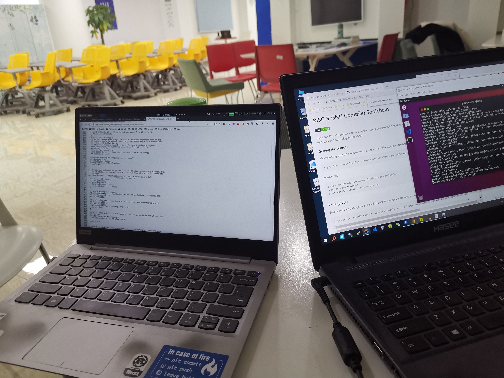

# lab4实验报告
组长 汪若辰 PB17000098

小组成员 余磊 PB17051053

## 实验要求

重新编译 LLVM 以使用 RISC-V 后端，将 C 程序编译成 RISC-V 下的可执行文件并运行；阅读并理解 LLVM 中的 `RegAllocFast.cpp`。

## 报告内容 
### 1. RISC-V 机器代码的生成和运行

#### 重新编译 LLVM

```bash
# 下载
cd ~/temp
wget https://github.com/llvm/llvm-project/releases/download/llvmorg-8.0.1/llvm-8.0.1.src.tar.xz
wget https://github.com/llvm/llvm-project/releases/download/llvmorg-8.0.1/cfe-8.0.1.src.tar.xz

# 解压缩
tar xvf llvm-8.0.1.src.tar.xz
mv llvm-8.0.1.src llvm
tar xvf cfe-8.0.1.src.tar.xz
mv cfe-8.0.1.src llvm/tools/clang

# 编译
mkdir build && cd build
cmake -DLLVM_EXPERIMENTAL_TARGETS_TO_BUILD=RISCV -DLLVM_TARGETS_TO_BUILD=X86 ../llvm
make -j2
```


#### 配置 riscv-gnu-toolchain

```bash
# https://github.com/riscv/riscv-gnu-toolchain

cd ~/temp
git clone --recursive https://github.com/riscv/riscv-gnu-toolchain && cd riscv-gnu-toolchain
sudo apt install autoconf automake autotools-dev curl libmpc-dev \
        libmpfr-dev libgmp-dev gawk build-essential bison flex texinfo \
        gperf libtool patchutils bc zlib1g-dev libexpat-dev

# 选择了 /opt/riscv 作为安装路径
./configure --prefix=/opt/riscv
# Newlib 交叉编译器，用于生成 riscv64-unknown-elf*
sudo make
# Linux 交叉编译器，用于生成 riscv64-unknown-linux-gnu* (未用到)
sudo make linux
echo 'export PATH=/opt/riscv/bin:$PATH' >> ~/.bashrc 
```


#### 配置 RISC-V Proxy Kernel

```bash
# https://github.com/riscv/riscv-pk

cd ~/temp
git clone https://github.com/riscv/riscv-pk && cd riscv-pk
mkdir build && cd build
../configure --prefix=/opt/riscv --host=riscv64-unknown-elf
make
sudo make install
```


#### 配置 Spike

```bash
# https://github.com/riscv/riscv-isa-sim/

cd ~/temp
git clone https://github.com/riscv/riscv-isa-sim/ && cd riscv-isa-sim
sudo apt install device-tree-compiler
mkdir build && cd build
../configure --prefix=/opt/riscv
make # 此处有循环依赖报错：make: Circular libsoftfloat.so <- libsoftfloat.so dependency 
sudo make install
```


> 或者如果使用的 Linux 发行版是 Arch 系的话，可以直接使用 `pacman` 安装 `riscv64-linux-gnu-gcc` 和 `spike` 并安装 AUR 中的 `riscv-pk-git`。

#### 生成 RISC-V 汇编文件和可执行程序

```bash
cd ~/temp
wget -O gcd.c http://210.45.114.30/staff/compiler_cminus/raw/master/lab1_lexical_analyzer/testcase/gcd.cminus


# 方案一：先生成 RISC-V 汇编再生成可执行程序
# 注意：编译完成的 LLVM 在 ~/temp/build/bin 目录下
build/bin/clang -emit-llvm --target=riscv64 -march=rv64gc gcd.c -S -o gcd.ll  -I/opt/riscv/riscv64-unknown-elf/include
build/bin/llc -march=riscv64 gcd.ll -o gcd.s
riscv64-unknown-elf-gcc -o gcd_v1.riscv gcd.s

# 方案二：直接生成 RISC-V 可执行程序
riscv64-unknown-elf-gcc -o gcd_v2.riscv gcd.c
```

其中方案一生成的 IR 表示 `gcd.ll` 如下，注意到开头有 `target triple = "riscv64"`，表示目标机器架构为 RISC-V。

<details>
<summary>gcd.ll</summary>

```llvm
; ModuleID = 'gcd.c'
source_filename = "gcd.c"
target datalayout = "e-m:e-p:64:64-i64:64-i128:128-n64-S128"
target triple = "riscv64"

; Function Attrs: noinline nounwind optnone
define dso_local signext i32 @gcd(i32 signext %u, i32 signext %v) #0 {
entry:
  %retval = alloca i32, align 4
  %u.addr = alloca i32, align 4
  %v.addr = alloca i32, align 4
  store i32 %u, i32* %u.addr, align 4
  store i32 %v, i32* %v.addr, align 4
  %0 = load i32, i32* %v.addr, align 4
  %cmp = icmp eq i32 %0, 0
  br i1 %cmp, label %if.then, label %if.else

if.then:                                          ; preds = %entry
  %1 = load i32, i32* %u.addr, align 4
  store i32 %1, i32* %retval, align 4
  br label %return

if.else:                                          ; preds = %entry
  %2 = load i32, i32* %v.addr, align 4
  %3 = load i32, i32* %u.addr, align 4
  %4 = load i32, i32* %u.addr, align 4
  %5 = load i32, i32* %v.addr, align 4
  %div = sdiv i32 %4, %5
  %6 = load i32, i32* %v.addr, align 4
  %mul = mul nsw i32 %div, %6
  %sub = sub nsw i32 %3, %mul
  %call = call signext i32 @gcd(i32 signext %2, i32 signext %sub)
  store i32 %call, i32* %retval, align 4
  br label %return

return:                                           ; preds = %if.else, %if.then
  %7 = load i32, i32* %retval, align 4
  ret i32 %7
}

; Function Attrs: noinline nounwind optnone
define dso_local signext i32 @main() #0 {
entry:
  %retval = alloca i32, align 4
  %x = alloca i32, align 4
  %y = alloca i32, align 4
  %temp = alloca i32, align 4
  store i32 0, i32* %retval, align 4
  store i32 72, i32* %x, align 4
  store i32 18, i32* %y, align 4
  %0 = load i32, i32* %x, align 4
  %1 = load i32, i32* %y, align 4
  %cmp = icmp slt i32 %0, %1
  br i1 %cmp, label %if.then, label %if.end

if.then:                                          ; preds = %entry
  %2 = load i32, i32* %x, align 4
  store i32 %2, i32* %temp, align 4
  %3 = load i32, i32* %y, align 4
  store i32 %3, i32* %x, align 4
  %4 = load i32, i32* %temp, align 4
  store i32 %4, i32* %y, align 4
  br label %if.end

if.end:                                           ; preds = %if.then, %entry
  %5 = load i32, i32* %x, align 4
  %6 = load i32, i32* %y, align 4
  %call = call signext i32 @gcd(i32 signext %5, i32 signext %6)
  ret i32 0
}

attributes #0 = { noinline nounwind optnone "correctly-rounded-divide-sqrt-fp-math"="false" "disable-tail-calls"="false" "less-precise-fpmad"="false" "min-legal-vector-width"="0" "no-frame-pointer-elim"="true" "no-frame-pointer-elim-non-leaf" "no-infs-fp-math"="false" "no-jump-tables"="false" "no-nans-fp-math"="false" "no-signed-zeros-fp-math"="false" "no-trapping-math"="false" "stack-protector-buffer-size"="8" "target-features"="+a,+c,+d,+f,+m" "unsafe-fp-math"="false" "use-soft-float"="false" }

!llvm.module.flags = !{!0}
!llvm.ident = !{!1}

!0 = !{i32 1, !"wchar_size", i32 4}
!1 = !{!"clang version 8.0.1 (tags/RELEASE_801/final)"}
```
</details>

生成的汇编文件 `gcd.s` 如下。

<details>
<summary>gcd.s</summary>

```assembly
	.text
	.file	"gcd.c"
	.globl	gcd                     # -- Begin function gcd
	.p2align	2
	.type	gcd,@function
gcd:                                    # @gcd
# %bb.0:                                # %entry
	addi	sp, sp, -48
	sd	ra, 40(sp)
	sd	s0, 32(sp)
	sd	s1, 24(sp)
	sd	s2, 16(sp)
	addi	s0, sp, 48
	sw	a0, -40(s0)
	sw	a1, -44(s0)
	lw	a0, -44(s0)
	bnez	a0, .LBB0_2
	j	.LBB0_1
.LBB0_1:                                # %if.then
	lw	a0, -40(s0)
	sw	a0, -36(s0)
	j	.LBB0_3
.LBB0_2:                                # %if.else
	lw	s2, -40(s0)
	lw	s1, -44(s0)
	mv	a0, s2
	mv	a1, s1
	call	__divdi3
	mv	a1, s1
	call	__muldi3
	subw	a1, s2, a0
	mv	a0, s1
	call	gcd
	sw	a0, -36(s0)
	j	.LBB0_3
.LBB0_3:                                # %return
	lw	a0, -36(s0)
	ld	s2, 16(sp)
	ld	s1, 24(sp)
	ld	s0, 32(sp)
	ld	ra, 40(sp)
	addi	sp, sp, 48
	ret
.Lfunc_end0:
	.size	gcd, .Lfunc_end0-gcd
                                        # -- End function
	.globl	main                    # -- Begin function main
	.p2align	2
	.type	main,@function
main:                                   # @main
# %bb.0:                                # %entry
	addi	sp, sp, -32
	sd	ra, 24(sp)
	sd	s0, 16(sp)
	addi	s0, sp, 32
	sw	zero, -20(s0)
	addi	a0, zero, 72
	sw	a0, -24(s0)
	addi	a0, zero, 18
	sw	a0, -28(s0)
	lw	a0, -24(s0)
	lw	a1, -28(s0)
	bge	a0, a1, .LBB1_2
	j	.LBB1_1
.LBB1_1:                                # %if.then
	lw	a0, -24(s0)
	sw	a0, -32(s0)
	lw	a0, -28(s0)
	sw	a0, -24(s0)
	lw	a0, -32(s0)
	sw	a0, -28(s0)
	j	.LBB1_2
.LBB1_2:                                # %if.end
	lw	a0, -24(s0)
	lw	a1, -28(s0)
	call	gcd
	mv	a0, zero
	ld	s0, 16(sp)
	ld	ra, 24(sp)
	addi	sp, sp, 32
	ret
.Lfunc_end1:
	.size	main, .Lfunc_end1-main
                                        # -- End function

	.ident	"clang version 8.0.1 (tags/RELEASE_801/final)"
	.section	".note.GNU-stack","",@progbits
```
</details>

#### 运行程序

```bash
cd ~/temp
spike pk gcd_v1.riscv
spike pk gcd_v2.riscv
```

输出如下。

```bash
yu@ubuntu:~/temp$ spike pk gcd_v1.riscv
bbl loader
yu@ubuntu:~/temp$ spike pk gcd_v2.riscv
bbl loader
```

看来是因为我们的程序没有输出，所以这里没有显示什么有效信息。为此，将 `gcd(x,y);` 改成 `printf("%d\n",gcd(x,y));`，再次进行上述操作。

```bash
yu@ubuntu:~/temp$ spike pk gcd_v1.riscv
bbl loader
18
yu@ubuntu:~/temp$ spike pk gcd_v2.riscv
bbl loader
18
```

可以看到，两个 RISC-V 可执行程序都正确输出了 72 和 18 的最大公约数。

至此，我们完成了将 C 程序编译成 RISC-V 下的可执行文件并借助 RISC-V Proxy Kernel 运行它的任务。


另外，我们写了一个简单的 [Makefile](../test/Makefile) 来自动化编译和运行的过程。例如在编译 `gcd.c` 时使用 `make gcd`，运行时 `make run gcd`。省去自己打命令的麻烦。


### 2. LLVM 源码阅读与理解
#### `RegAllocFast.cpp` 中的问题
- `RegAllocFast` 的执行流程？
    `RegAllocFast` 是一个 Pass，它继承自 `MachineFunctionPass`，它通过重载 `runOnMachineFunction` 函数来发挥自己的功能。
    在它的 `runOnMachineFunction` 方法中，先是进行一系列初始化操作（主要是获取各类信息），然后开始执行自己的核心操作：映射虚拟寄存器到物理寄存器。为了完成这样的目标，它先初始化虚拟寄存器到物理寄存器的映射表，即把每个虚拟寄存器都先映射到空值，接着，对函数中的每个 BasicBlock 调用 `allocateBasicBlock` 函数，使得所有的操作数和相关引用里的虚拟寄存器都被替换成物理寄存器，从而完成自己的使命，最后，虚拟寄存器已经失去了作用，将和它们相关的量都清空即可。

    下面来说一下 `allocateBasicBlock` 函数，它的作用是为一个基本块中的所有虚拟寄存器分配物理寄存器。在这个函数内，先把目标机器的物理寄存器都标记为 disabled 状态，再检查是否还有虚拟寄存器到物理寄存器的映射，如果有，说明为前一个 BasicBlock 执行此函数后映射表没有完全清空，是不正常状态。接着，对当前 BasicBlock 的入口处的活跃寄存器（即活跃变量所对应的虚拟寄存器）保留物理寄存器，然后，对 BasicBlock 中的每条指令调用 `allocateInstruction` 函数（这一部分将在下个问题介绍），之后，再把所有被使用（存储着到虚拟寄存器的映射）的物理寄存器全部 spill 到内存中（看起来没必要全部 spill，可能只是为了 debug 吧），最后，从当前 BasicBlock 中消除由于合并操作导致的无用的指令（合并后多个变量分配到同一个物理寄存器，因此 move 指令变得多余）。


- `allocateInstruction` 函数有几次扫描过程以及每一次扫描的功能？
    
    有 4 次扫描过程，每一遍的功能分别如下。
        - 第一遍：在当前指令的操作数中，为处于 use 状态的操作数标记上将使用物理寄存器，为在 early clobber list 中的操作数给物理寄存器标记上 free 或 reserved 的状态；计算 `hasTiedOps`, `hasEarlyClobbers` 和 `hasPartialRedefs` 这几个标志量；处理几种需要在 use 状态和 define 状态被分配到同一寄存器的情形；
        - 第二遍：为 defined 且处于 use 状态的虚拟寄存器分配物理寄存器；为 undefined 的操作数分配寄存器；如果当前指令是函数调用，把所有虚拟寄存器都 spill 到内存；
        - 第三遍：为处于 define 状态的物理寄存器标记状态为 free 或 reserved；
        - 第四遍：为处于 define 状态的虚拟寄存器分配物理寄存器；kill 掉死的处于 define 状态的虚拟寄存器。


- `calcSpillCost` 函数的执行流程？

    此函数返回在一个指令中将一个寄存器及其重名寄存器（例如 x86 中的 ax 和 eax 就为「重名的」寄存器）存至内存中以腾出空间的代价。
    - 如果此寄存器已经在本指令中用到，则不应该再分配它，返回「无穷大」代价（`unsigned` 最大值）；
    - 如果此寄存器没有被 disabled（此时可以被分配），则根据它的状态返回代价
        - 如果是 free，则代价为 0；
        - 如果 reserved，则代价为「无穷大」；
        - 如果是其它，找到和它对应的虚拟寄存器，根据它是否 dirty 确定代价。
    - 如果此寄存器被 disabled，则检查所有和它重名的寄存器，将重名寄存器的代价相加为此寄存器的代价。

- `hasTiedOps`，`hasPartialRedefs`，`hasEarlyClobbers` 变量的作用？
    - `hasTiedOps`: 用于指示当前指令的操作数中是否有 tied operand，tied operand 指的是这个（作为结果）的操作数和一个作为输入的操作数共享寄存器，从而，当对作为结果的寄存器做完修改后，编译器就不能再使用那个作为输入的操作数，因为它的值也已经被改变；
    - `hasPartialRedefs`: 用于指示当前指令的操作数是否有 partial redefine，partial redefine 指的是一个寄存器的子寄存器被重新定义，如 `%eax` 本来已被 tied 到一个变量，之后其低位 `%ax` 又被 tied 到另一个变量；
    - `hasEarlyClobbers`: 用于指示是否有操作数在 early blobber list 中，从而告诉编译器，这个（作为结果）的操作数会被在所有输入都被使用前写入，因此不能让它和任何输入的操作数共享寄存器。

#### 书上算法与 LLVM 的实现之间的不同点


## 组内讨论内容
### 讨论 1
- 时间：2019-12-13 下午
- 地点：西区图书馆
- 参与者：wrc, yl


分工
- yl 完成配置环境并运行 RISC-V 程序的部分和 `allocateInstruction` 函数有关部分；
- wrc 完成 `calcSpillCost` 函数部分和龙书的部分。

## 实验总结

- 学会了如何在 x86 平台下为 C 程序生成 RISC-V 架构的汇编文件和可执行程序，并使用 Spike 模拟执行；
- 学习了常见的寄存器分配算法，通过阅读 `RegAllocFast.cpp` 了解了作为 LLVM Debug 版本默认算法的 Fast 寄存器分配算法的基本工作原理。

## 实验反馈
- 怎么又把 PDF 文件放到仓库里面了（gbxu/notice_board#177）
